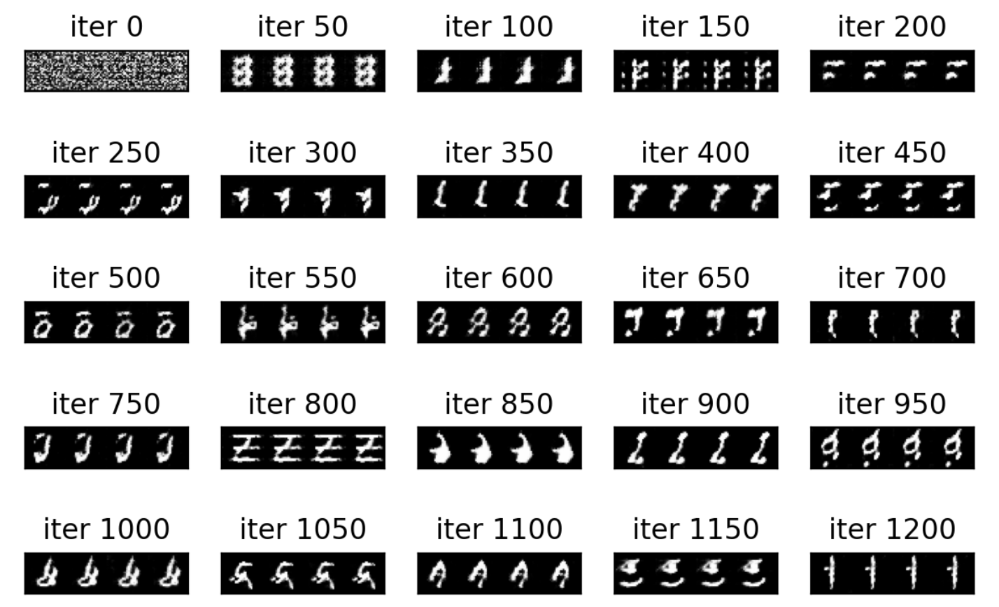

# Pytorch深度學習框架X NVIDIA JetsonNano應用-生成手寫數字

| 作者 | Chia-Chun, Chang |
| ---- | ---|
| 所屬單位  | Cavedu 教育團隊 |
| 開發日期  | 10908 |
| 文章連結  | https://www.rs-online.com/designspark/pytorchx-nvidia-jetsonnano-3-cn |

___

## 介紹
遇到生成的問題一定是要找現在最流行的GAN，那今天我們除了要讓大家了解GAN是什麼之外，我們也要來挑戰Jetson Nano的極限，上次已經用Nano跑貓狗分類發現對於它來說已經相當的艱辛了，這次要給它更艱難的任務，我們要讓電腦學習如何生成手寫數字的圖片！

